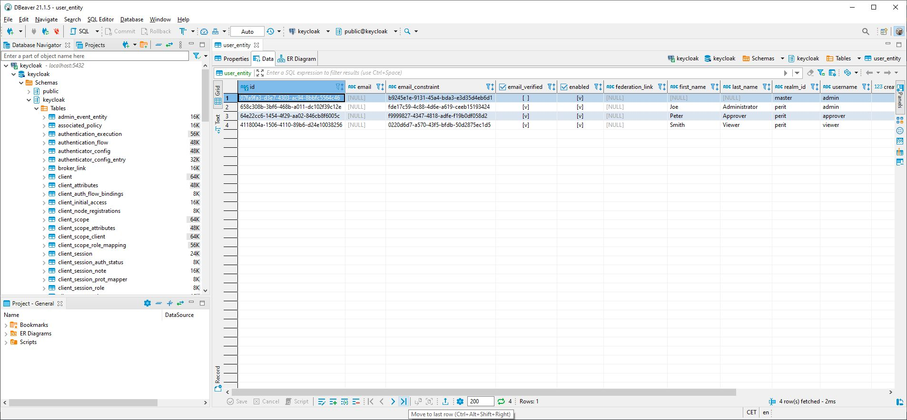
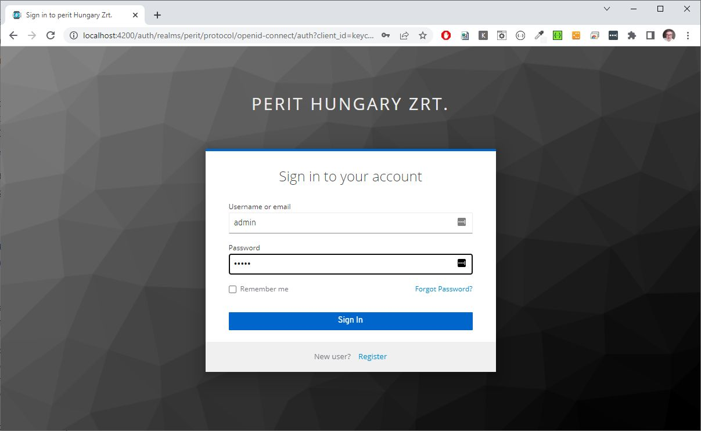
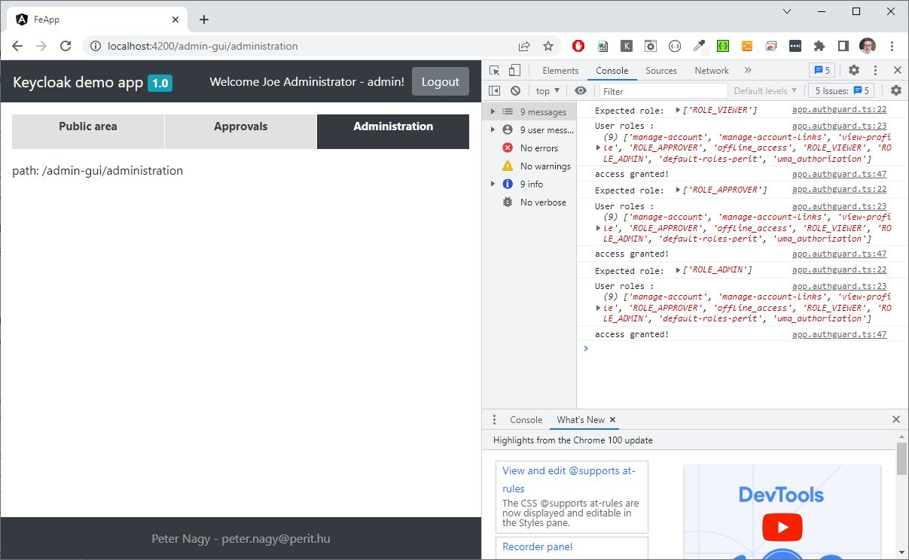
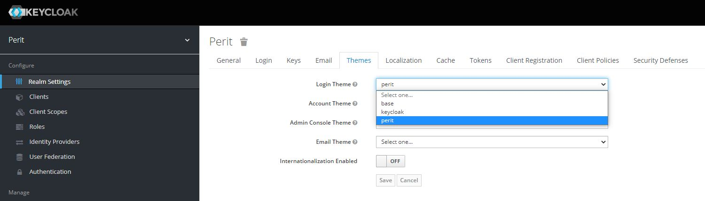

# keycloak study

This is a fully functional Keycloak sample using Angular and Spring Boot. This was my second attemp to create a sample application.  

The first time I tried to stick to an existing application and my goal was to not have to change anything on the interfaces. This could not be completed. Now, I’m not trying to do that, I’m trying to find out how the creators dreamed of Keycloak?

I couldn’t find a complete guide with Angular and Spring Boot anywhere, so I did it myself. There are a lot of thymeleaf and standalone Angular examples, but there is no one where the frontend redirects to the login window of the keycloak and then calls into the Spring based backend with the acquired token.

This sample is based on spvitamin 1.3.12-RELEASE, which includes a package for Keycloak support: `hu.perit.spvitamin:spvitamin-spring-security-keycloak`.

References:
- [Introducing Keycloak for Identity and Access Management](https://www.thomasvitale.com/introducing-keycloak-identity-access-management/)
- [Keycloak Basic Configuration for Authentication and Authorization](https://www.thomasvitale.com/keycloak-configuration-authentication-authorisation/)
- [Keycloak Authentication Flows, SSO Protocols and Client Configuration](https://www.thomasvitale.com/keycloak-authentication-flow-sso-client/)

## Setup

1. Start the PostgreSQL container (user: postgres, pwd: sa)
2. Create a new database with the name __keycloak__
3. Create a new schema with the name __keycloak__
4. Now start the keycloak container as well. This will initialize the database.
5. Import the realm from __realm-export.json__
6. make a new entry in your hosts file `127.0.0.1 keycloak`
7. gradlew doI
8. start the docker swarm `keycloakstudy\docker-compose\keycloakstudy\docker-compose.yml`
9. the frontend can be found at: http://localhost:9400





## Links:
- Admin console: http://localhost:8180
- User account self-service: http://localhost:8180/auth/realms/perit/account
- keycloak.js: http://localhost:8180/auth/js/keycloak.js

## Authentication with username and password
This is the __Resource Owner Password Credentials Grant__ flow. __Direct Access Grants__ has to be enabled in the client.

Request


Response
```json
{
    "access_token": "eyJhbGciOiJSUzI1NiIsInR5cCIgOiAiSldUIiwia2lkIiA6ICJOTTR...",
    "expires_in": 300,
    "refresh_expires_in": 1800,
    "refresh_token": "eyJhbGciOiJIUzI1NiIsInR5cCIgOiAiSldUIiwia2lkIiA6ICJmYTI1ODczZi01Zj...",
    "token_type": "bearer",
    "not-before-policy": 0,
    "session_state": "d677dd79-efba-4c9a-99cc-01ddfffb6343",
    "scope": "profile email"
}
```

### Refresh

Once the access token has expired, we can refresh it by sending a POST request to the same URL as above, but containing the refresh token instead of username and password:


Keycloak will respond to this with a new access_token and refresh_token.

## Using Keycloak in Angular

References:
- [Keycloak integration](https://sairamkrish.medium.com/keycloak-integration-part-2-integration-with-angular-frontend-f2716c696a28)
- https://github.com/mauriciovigolo/keycloak-angular




### Steps

#### Install the following packages:
```typescript
"keycloak-angular": "^8.4.0",
"keycloak-js": "^16.1.1",
```

#### Initialize the keycloak service
environment.ts
```typescript
import {KeycloakOptions} from 'keycloak-angular';

const keycloakUrl = '/auth';

const keycloakConfig: KeycloakOptions = {
  config: {
    url: keycloakUrl,
    realm: 'perit',
    clientId: 'keycloak-study'
  },
  initOptions: {
    onLoad: 'check-sso',
    silentCheckSsoRedirectUri:
      window.location.origin + '/assets/silent-check-sso.html',
  },
};

export const environment = {
  production: false,
  keycloakOptions: keycloakConfig,
  keycloakUrl: keycloakUrl
};
```

keycloak-init.factory.ts
```typescript
export function initializeKeycloak(keycloakService: KeycloakService)
{
  return () => keycloakService.init(environment.keycloakOptions);
}
```
#### silent-check-sso.html
See the assets folder:
```html
<html>
  <body>
    <script>
      parent.postMessage(location.href, location.origin);
    </script>
  </body>
</html>
```
#### proxy
proxy.conf.js
```js
const PROXY_CONFIG = [
  {
    context: [
      "/auth/**",
    ],
    target: "http://localhost:8180",
    secure: false
  }
]

module.exports = PROXY_CONFIG;
```
angular.json
```json
        "serve": {
          "builder": "@angular-devkit/build-angular:dev-server",
          "options": {
            "browserTarget": "fe-app:build",
            "proxyConfig": "src/proxy.conf.js"
          },

```
#### guard
```typescript
@Injectable()
export class AppAuthGuard extends KeycloakAuthGuard
{
  constructor(protected router: Router, protected keycloakAngular: KeycloakService)
  {
    super(router, keycloakAngular);
  }

  isAccessAllowed(route: ActivatedRouteSnapshot, state: RouterStateSnapshot): Promise<boolean>
  {
    return new Promise(async (resolve, reject) =>
    {
      if (!this.authenticated)
      {
        this.keycloakAngular.login();
        return;
      }
      console.log('Expected role: ', route.data.roles);
      console.log('User roles :', this.roles);
      const requiredRoles = route.data.roles;
      let granted: boolean = false;
      if (!requiredRoles || requiredRoles.length === 0)
      {
        granted = true;
      } else
      {
        for (const requiredRole of requiredRoles)
        {
          if (this.roles.indexOf(requiredRole) > -1)
          {
            granted = true;
            break;
          }
        }
      }

      if (!granted)
      {
        console.warn('access denied!');
        this.router.navigate(['/']);
      } else
      {
        console.log('access granted!');
      }
      resolve(granted);

    });
  }
}
```
#### router
```typescript
export const routes: Routes = [
  {path: '', redirectTo: 'admin-gui/public', pathMatch: 'full'},
  {path: 'admin-gui', redirectTo: 'admin-gui/public', pathMatch: 'full'},
  {
    path: 'admin-gui', component: TabSetComponent,
    children: [
      {path: 'public', component: SomeContentComponent, canActivate: [AppAuthGuard], data: {roles: ['ROLE_VIEWER']}},
      {path: 'approvals', component: SomeContentComponent, canActivate: [AppAuthGuard], data: {roles: ['ROLE_APPROVER']}},
      {path: 'administration', component: SomeContentComponent, canActivate: [AppAuthGuard], data: {roles: ['ROLE_ADMIN']}},
    ],
  },
];
```

## Integrating with the backend

References:
- [Step-by-step guide how integrate Keycloak with Angular application](https://sairamkrish.medium.com/keycloak-integration-part-2-integration-with-angular-frontend-f2716c696a28)

We will use the following module: `org.keycloak:keycloak-spring-boot-starter`. This contains a `KeycloakWebSecurityConfigurerAdapter` with that we can secure some REST endpoints using the OAuth2 protocol.

Although there is a pretty big problem with the standard implementation, there is an improved package in spvitamin. Keycloak-protected endpoints work by validating the token if there is an authorization header in the call. If there is no token in the call, it redirects to the `/sso/login` endpoint first, which redirects the frontend to the Keycloak login window. I was unable to put this mechanism into operation with a desperate struggle for a day and a half. This is because the browser refused to go to the login page due to CORS protection.

So I decided to disable redirection in the backend, now there is only token validation. If the token is missing or invalid, a 401 will be returned. It is up to the frontend to decide how to handle the 401 error. It is possible to make a general handler that intercepts 401 errors with an interceptor and tries to authenticate it from within the frontend, which does not cause a CORS problem.

Token update works automatically within the frontend. You can sign up for a Keycloak event that watches e.g. to the `OnTokenExpired` event and updates the token.

```typescript
  private keycloakEvents: Subject<KeycloakEvent> = this.keycloakService.keycloakEvents$;

  constructor(
    private keycloakService: KeycloakService
  )
  {
    this.loadUserProfile();

    this.keycloakEvents.subscribe({
      next: (e: KeycloakEvent) =>
      {
        if (e.type == KeycloakEventType.OnAuthSuccess)
        {
          console.log('Keycloak event: AuthSuccess');
          this._authenticated = true;
        }
        if (e.type == KeycloakEventType.OnAuthLogout)
        {
          console.log('Keycloak event: AuthLogout');
          this._authenticated = false;
        }
        if (e.type == KeycloakEventType.OnTokenExpired)
        {
          console.log('Keycloak event: TokenExpired');
          //keycloakService.updateToken();
        }
        if (e.type == KeycloakEventType.OnAuthRefreshSuccess)
        {
          console.log('Keycloak event: AuthRefreshSuccess');
        }
      }
    });
  }
```

Although I did not use this approach, because it prevents the idle-state of the session from being monitored. When someone does not use the application, after a set timeout (`SSO Session Idle` setting in the Keycloak client), the session becomes invalid and the frontend no longer sends the token to the backend. In this case, the backend returns a 401 response.


### Steps

#### Import KeycloakAngularModule

This will intercept HTTP communication and inject the JWT token into the authorization header.

```typescript
@NgModule({
  declarations: [
      ...
  ],
  imports: [
    KeycloakAngularModule, <==
  ],
  providers: [
      ...
  ],
  bootstrap: [AppComponent]
})
```

#### proxy
We will create a new proxy target for the backend REST endpoint. Please note the changeOrigin=true, this is important otherwise we will get a Keycloak error.
```typescript
const PROXY_CONFIG = [
  {
    context: [
      "/auth/**",
    ],
    target: "http://localhost:8180",
    secure: false,
    changeOrigin: true
  },
  {
    context: [
      "/books",
    ],
    target: "http://localhost:8400",
    secure: false,
    changeOrigin: true
  }
]

module.exports = PROXY_CONFIG;
```

#### dependencies
```
dependencies {
    // spvitamin
    implementation 'hu.perit.spvitamin:spvitamin-core'
    implementation 'hu.perit.spvitamin:spvitamin-spring-general'
    implementation 'hu.perit.spvitamin:spvitamin-spring-server'
    implementation 'hu.perit.spvitamin:spvitamin-spring-admin'
    implementation 'hu.perit.spvitamin:spvitamin-spring-security'
    implementation 'hu.perit.spvitamin:spvitamin-spring-security-keycloak'

    // Spring Boot
    implementation 'org.springframework.boot:spring-boot-starter-web'
    implementation 'org.springframework.boot:spring-boot-starter-security'
    implementation 'org.springframework.boot:spring-boot-starter-thymeleaf'
    implementation 'org.springframework.boot:spring-boot-starter-validation'

    // Keycloak
    implementation 'org.keycloak:keycloak-spring-boot-starter'

    ...
}
```

#### WebSecurityConfig

```java
@EnableWebSecurity
@Slf4j
public class WebSecurityConfig
{

    /*
     * ============== Order(1) =========================================================================================
     */
    @KeycloakConfiguration
    @Order(1)
    @DependsOn(value = "SpvitaminSpringContext")
    public static class Order1 extends SimpleKeycloakWebSecurityConfigurerAdapter
    {
        /**
         * This is a global configuration, will be applied to all oder configurer adapters
         *
         * @param auth
         * @throws Exception
         */
        @Autowired
        public void configureGlobal(AuthenticationManagerBuilder auth) throws Exception
        {
            auth.authenticationProvider(keycloakAuthenticationProvider());
        }


        @Override
        protected void configure(HttpSecurity http) throws Exception
        {
            scope(http,
                    //"/sso/**",
                    BookApi.BASE_URL_BOOKS + "/**"
            )
                    .authorizeRequests()
                    .antMatchers(HttpMethod.GET, BookApi.BASE_URL_BOOKS + "/**").hasRole("VIEWER")
                    .antMatchers(HttpMethod.POST, BookApi.BASE_URL_BOOKS + "/**").hasRole("ADMIN")
                    .antMatchers(HttpMethod.PUT, BookApi.BASE_URL_BOOKS + "/**").hasRole("ADMIN")
                    .antMatchers(HttpMethod.DELETE, BookApi.BASE_URL_BOOKS + "/**").hasRole("ADMIN")
                    .anyRequest().denyAll();

            configureKeycloak(http);
        }
    }


    /*
     * ============== Order(2) =========================================================================================
     */
    @Configuration
    @Order(2)
    public static class Order2 extends WebSecurityConfigurerAdapter
    {

        @Override
        protected void configure(HttpSecurity http) throws Exception
        {
            SimpleHttpSecurityBuilder.newInstance(http)
                    .scope(
                            "/fe-app/**"
                    )
                    .authorizeRequests()
                    .anyRequest().permitAll();

            SimpleHttpSecurityBuilder.afterAuthorization(http).basicAuth();
        }
    }
}
```

## Customizing the login theme

See the keycloak folder for a customized image containing a custom theme.


