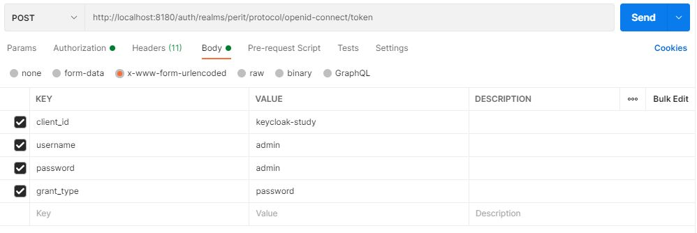
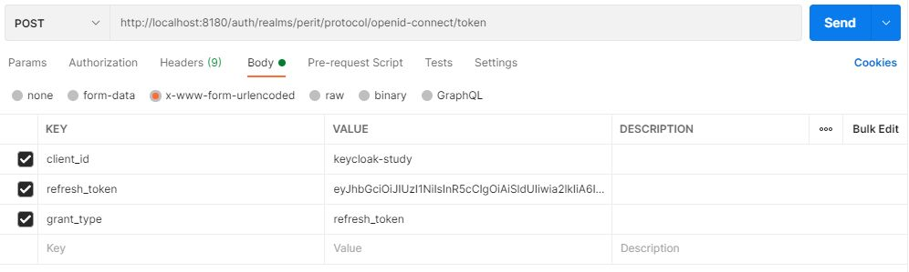

# keycloak study

This is a project for demonstrating purposes.

References:
- [Introducing Keycloak for Identity and Access Management](https://www.thomasvitale.com/introducing-keycloak-identity-access-management/)
- [Keycloak Basic Configuration for Authentication and Authorization](https://www.thomasvitale.com/keycloak-configuration-authentication-authorisation/)
- [Keycloak Authentication Flows, SSO Protocols and Client Configuration](https://www.thomasvitale.com/keycloak-authentication-flow-sso-client/)

## Setup

1. Start the PostgreSQL container (user: postgres, pwd: sa)
2. Create a new database with the name __keycloak__
3. Create a new schema with the name __keycloak__
4. Now start the keycloak container as well. This will initialize the database.
5. Import the realm from __realm-export.json__

## Links:
- Admin console: http://localhost:8180
- User account self-service (2 FA can be enabled): http://localhost:8180/auth/realms/perit/account
- keycloak.js: http://localhost:8180/auth/js/keycloak.js

## Authentication with username and password
This is the __Resource Owner Password Credentials Grant__ flow. __Direct Access Grants__ has to be enabled in the client.

Request


Response
```json
{
    "access_token": "eyJhbGciOiJSUzI1NiIsInR5cCIgOiAiSldUIiwia2lkIiA6ICJOTTR...",
    "expires_in": 300,
    "refresh_expires_in": 1800,
    "refresh_token": "eyJhbGciOiJIUzI1NiIsInR5cCIgOiAiSldUIiwia2lkIiA6ICJmYTI1ODczZi01Zj...",
    "token_type": "bearer",
    "not-before-policy": 0,
    "session_state": "d677dd79-efba-4c9a-99cc-01ddfffb6343",
    "scope": "profile email"
}
```

### Refresh

Once the access token has expired, we can refresh it by sending a POST request to the same URL as above, but containing the refresh token instead of username and password:



Keycloak will respond to this with a new access_token and refresh_token.

## Using Keycloak in Angular

- [Keycloak integration](https://sairamkrish.medium.com/keycloak-integration-part-2-integration-with-angular-frontend-f2716c696a28)
- https://github.com/mauriciovigolo/keycloak-angular


